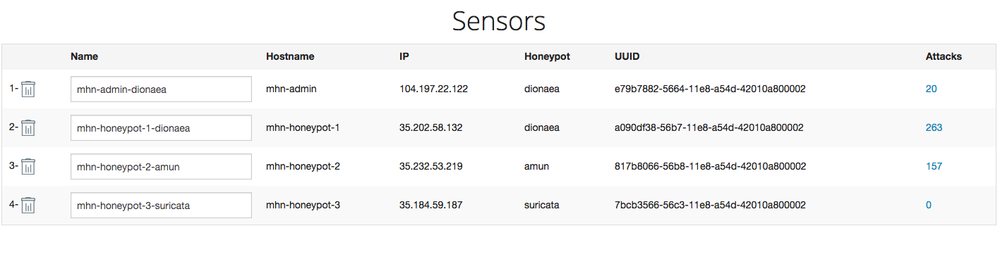

# Week-09-Web-Security

<h3>Honeypots Deployed</h3>

  * Dionnea
  * Amun
  * Suricata
 
 
 <h4>Issues</h4>
 I ran into a lot of google cloud issues where I did not have credits. I also had initial issues with the instructions because they were not presented clearly. After they were updated I was able to do some work but still had trouble using google cloud. There was missing information from the instructions that I had a friend clear up. For example, in Google Cloud's settings you have to allow http and https traffic on mhn-admin in order to access it. 
 <h4> Number of attacks: 444</h4>
 I saw in this assignment that a lot of attacks are being conducted constantly on the internet. I saw many virus attempts come in and it goes to show you how important network security really is. If this was my local machine I would have been infected with many viruses by now. 
 
 JSON Export is included in the repo
 
 
